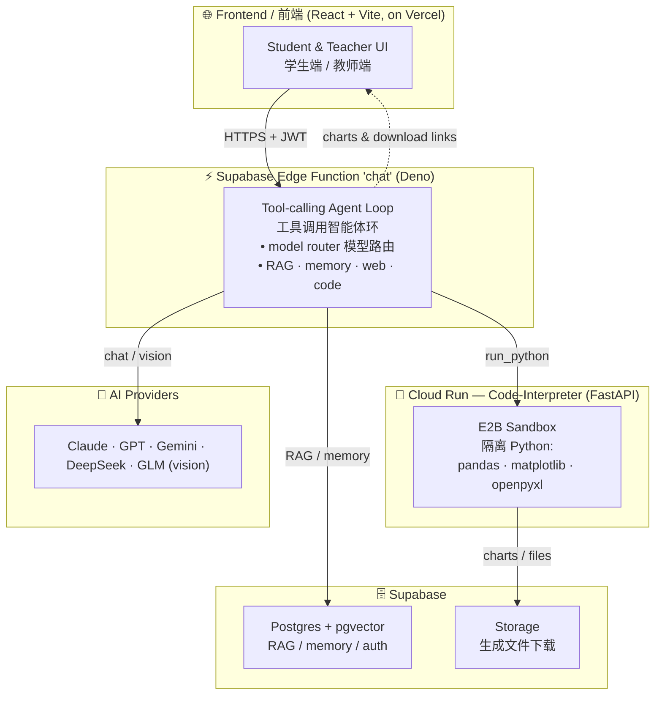
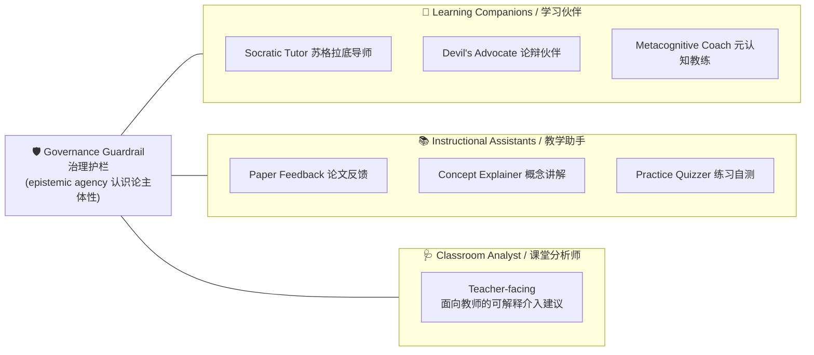
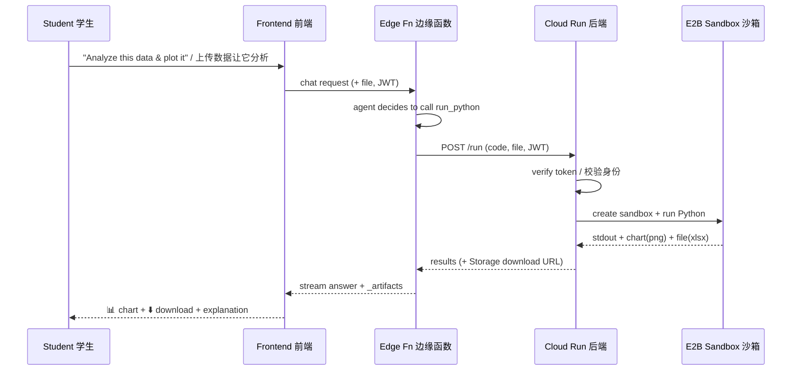

<div align="center">

# 🎓 AI Academic Tutor

**A research-grounded, multi-agent AI tutor that protects student epistemic agency.**
**一个有研究依据、守护学生「认识论主体性」的多智能体 AI 学术导师。**


[English](#-english) · [中文](#-中文)

</div>

---

> **Philosophy / 理念** — The AI is a **supporter of thinking, not a ghostwriter**. It never completes graded or community knowledge on the student's behalf; it exposes ideas, counter-arguments, structure, and questions, and always leaves the student as the author.
> AI 是**思考的支持者,不是代笔者**。它绝不替学生完成被评分/计入共同体的成品,只暴露思路、反例、结构与问题,学生始终是知识的作者。

---

## 🏗️ Architecture / 系统架构



The student's browser only ever talks to the **Edge Function**, which orchestrates everything server-side — so the code-interpreter backend and AI providers are never called directly from the client.
学生浏览器只与**边缘函数**通信,所有重活在服务端编排——后端与模型从不被前端直连。

---

## 🤖 The Agent Ecosystem / 智能体生态

Built around the three agent archetypes from learning-sciences research, all wrapped by a **governance guardrail**.
围绕学习科学的三类智能体原型构建,外加统一的**治理护栏**。



| Capability / 能力 | What it does / 作用 |
|---|---|
| 🤖 **Selectable roles** 可选角色 | 7 learning-companion / assistant roles, each a learning-science-grounded prompt |
| 🖼️ **Multimodal** 多模态 | Upload a figure / screenshot / handwriting → a vision model reads it |
| 🐍 **Code interpreter** 代码解释器 | Analyze tables, draw charts, generate Excel / Word in a sandbox |
| 🔍 **RAG + deep search** 检索 | pgvector retrieval + multi-angle query decomposition |
| 🕸️ **Knowledge graph** 知识图谱 | Auto-extracted concept map (React Flow) |
| 🧠 **Cross-session memory** 跨会话记忆 | Remembers research progress, decisions, pain points |
| 🪄 **Auto model routing** 自动选模型 | Picks the best model per task (reasoning / code / long / vision) |
| 👩‍🏫 **Teacher dashboard** 教师端 | Monitor, intervene, and get interpretable analyst suggestions |

---

## 🔬 How a code-interpreter request flows / 代码解释器请求流程



---

## 🧩 Tech Stack / 技术栈

| Layer 层 | Tech |
|---|---|
| Frontend 前端 | React 19 · Vite 6 · TypeScript 5 · Tailwind · React Flow · Recharts |
| Backend 后端 | Supabase Edge Functions (Deno) · FastAPI (Cloud Run) · E2B sandbox |
| Data 数据 | Postgres + pgvector · Supabase Auth · Storage |
| AI | Multi-provider (Claude / GPT / Gemini / DeepSeek / GLM) via an OpenAI-compatible gateway |
| Hosting 托管 | Vercel (frontend) · Supabase (edge + db) · Google Cloud Run (code-interpreter) |

---

## 📁 Project Structure / 目录结构

```
.
├── src/                       # React frontend / 前端
│   ├── features/              # student / supervisor / auth / landing
│   ├── services/              # AI, conversation, RAG, agent-roles …
│   └── shared/                # shared UI components
├── supabase/
│   ├── functions/chat/        # the core tool-calling agent (edge function)
│   └── migrations/            # DB schema (Postgres + pgvector + RLS)
├── code-interpreter/          # FastAPI backend → E2B sandbox (Cloud Run)
└── .github/workflows/         # CI: auto-deploy the backend on push
```

---

## 🚀 Getting Started (Local) / 本地启动

```bash
# 1. Frontend
npm install
cp .env.local.example .env.local   # fill in your own keys (see below)
npm run dev

# 2. Code-interpreter backend (Docker)
cd code-interpreter
docker build -t ci-backend:local .
docker run -d -p 8080:8080 --env-file .env ci-backend:local   # see code-interpreter/.env.example
curl localhost:8080/healthz
```

**Environment variables** are read from `.env` files (git-ignored) and platform secret stores — **no keys are committed to this repo.** See `code-interpreter/.env.example` for the template.
**所有密钥**都从 `.env`(已 gitignore)和平台密钥库读取——**仓库里不含任何密钥**。模板见 `code-interpreter/.env.example`。

---

## ☁️ Deployment / 部署

| Target 目标 | How / 方式 |
|---|---|
| **Frontend** 前端 | `git push` → **Vercel** auto-deploy |
| **Backend** 后端 | `git push` → **GitHub Actions** → Google Cloud Run (`.github/workflows/`) |
| **Edge Function** 边缘函数 | `supabase functions deploy chat` (Supabase CLI) |

Deploy guide for the code-interpreter backend: see [`code-interpreter/README.md`](code-interpreter/README.md).
后端部署详见 [`code-interpreter/README.md`](code-interpreter/README.md)。

---

## 🛡️ Design Principles / 设计原则

1. **Epistemic agency first / 认识论主体性优先** — support thinking, never substitute it.
2. **Governable & interpretable / 可治理、可解释** — every agent intervention is logged with its rationale; the teacher can accept / edit / dismiss.
3. **Grounded, not hallucinated / 有据可查** — answers cite the knowledge base or the web; never fabricate sources or data.
4. **Teacher in the loop / 教师在环** — teachers monitor and intervene; the AI defers to the teacher.
5. **Privacy by design / 隐私优先** — secrets live only in env vars / secret stores; student data is RLS-protected.

---

## 🔒 Security & Privacy / 安全与隐私

- **No secrets in the repository.** API keys, service-account keys, and tokens are kept in environment variables / GitHub & Cloud secret stores — never committed.
- **仓库不含任何密钥。** API key、服务账号密钥、令牌均存于环境变量 / 平台密钥库,绝不入库。
- Row-Level Security (RLS) protects per-user data in Postgres.
- The code sandbox is fully isolated (E2B micro-VM) and never receives database credentials.

---

## 📄 License & Disclaimer / 许可与免责

Released under the **MIT License**. This is a research prototype; it is **not** a substitute for professional academic, medical, legal, or financial advice. The AI assists learning and never completes graded work on a student's behalf.
以 **MIT 许可**发布。本项目为研究原型,**不**替代专业的学术/医疗/法律/金融建议;AI 仅辅助学习,绝不代替学生完成被评分的作业。

---

<div align="center">
Made with care for learners who want to think, not just get answers.<br/>
为「想思考、而不只是要答案」的学习者而做。
</div>
