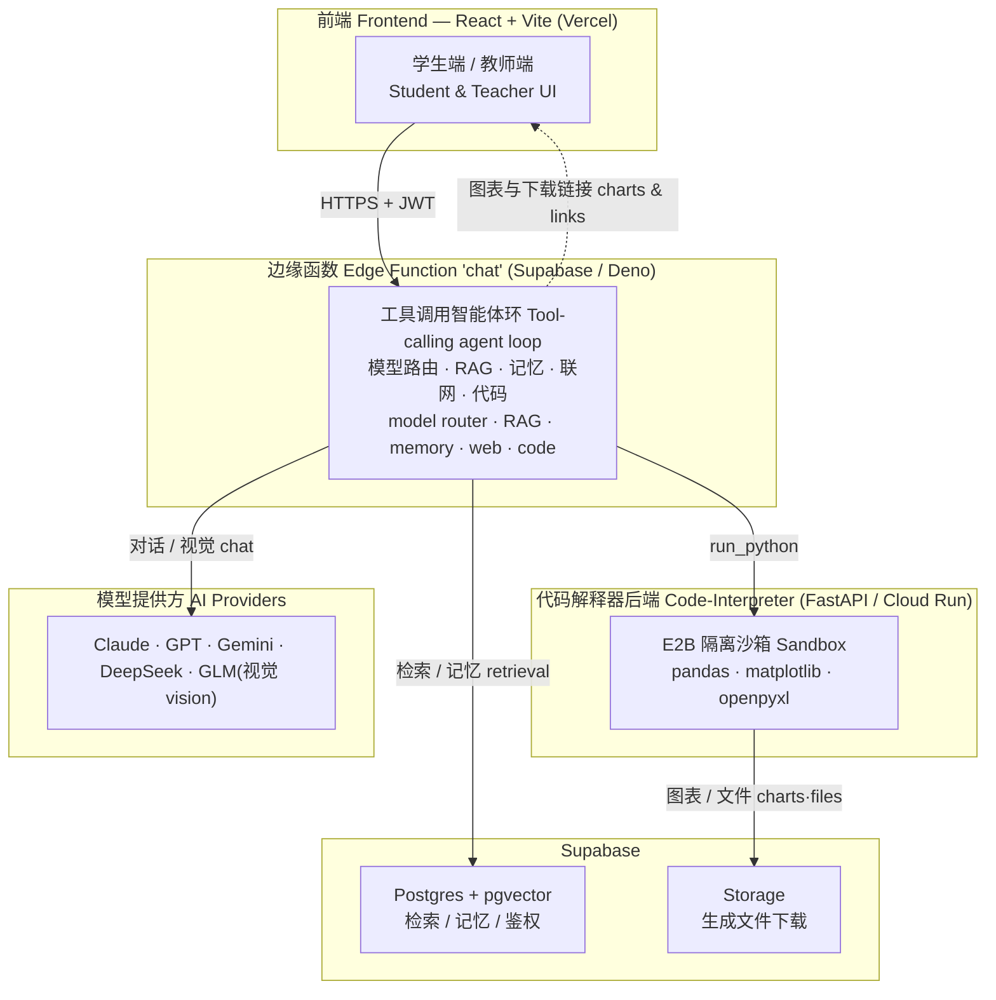
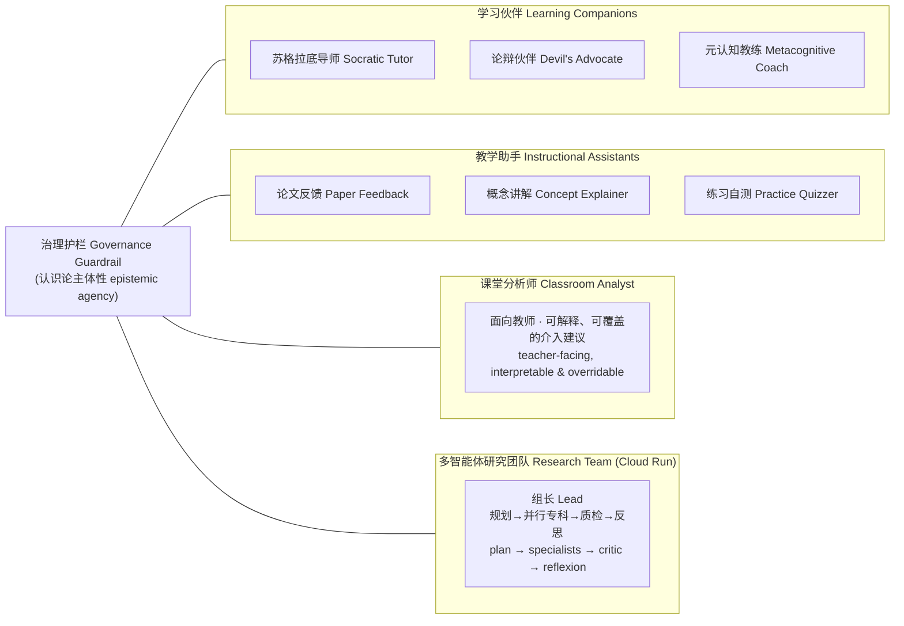
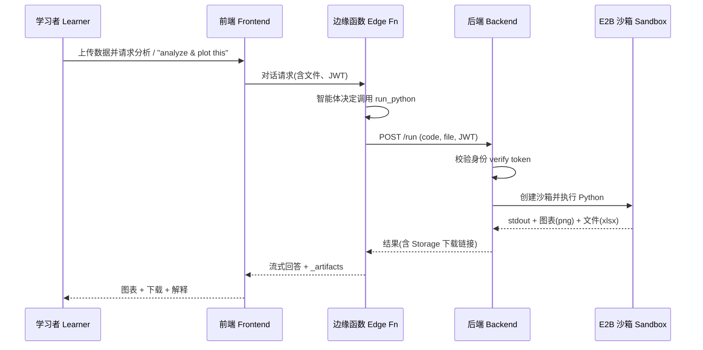
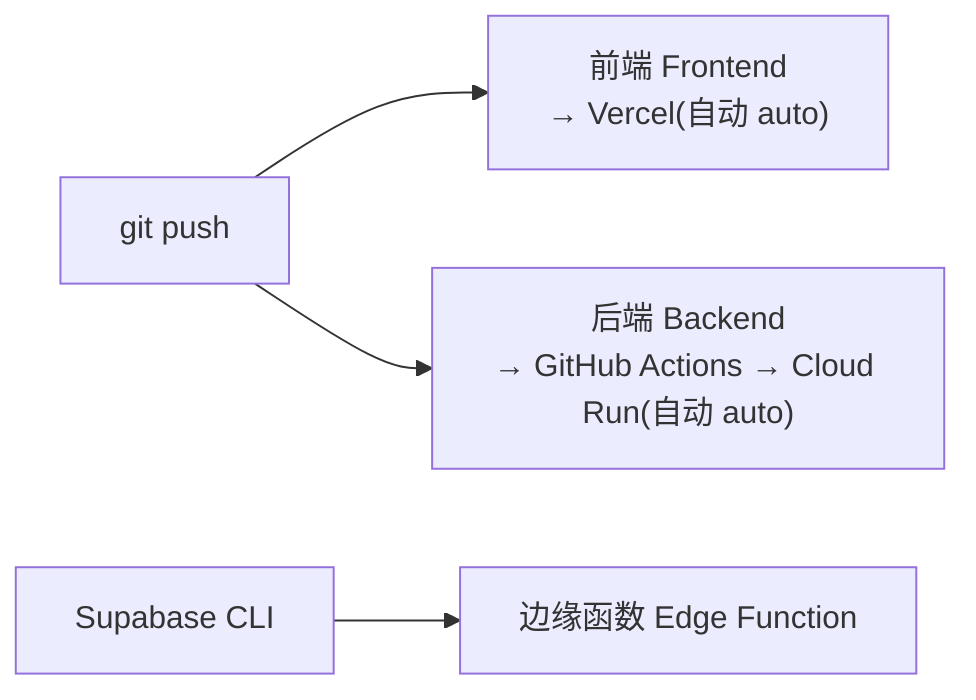

<div align="center">

# AI Academic Tutor

**面向研究生科研训练与课程学习的多智能体辅导系统,以保护学习者的认识论主体性(epistemic agency)为核心设计原则。**

**A multi-agent tutoring system for graduate research and course learning, designed around a single principle: preserving the learner's epistemic agency.**


[](https://www.techedu.icu/)

### 🌐 在线访问 / Live demo — **[www.techedu.icu](https://www.techedu.icu/)**

[中文文档](#中文文档) · [English](#english)

</div>

---

> **设计立场** —— 系统将 AI 定位为「思考的支持者」,而非「成果的代笔者」。它不替学习者完成将被评分或计入学习共同体的成品,而是通过提问、反例、结构化支架与可核查的依据,促使学习者始终保持对自身知识的作者身份。
>
> **Design stance** —— The system treats AI as a *supporter of thinking*, not a ghostwriter of deliverables. It does not complete graded or community-bound artifacts on a learner's behalf; it surfaces questions, counter-examples, scaffolding, and verifiable evidence, so that the learner remains the author of their own knowledge.

---

## 架构总览 / Architecture

> 节点标签为中英双语,两个语言版本共用以下图示。
> Diagram labels are bilingual and shared by both language sections.

**系统架构 / System architecture**



学习者浏览器仅与**边缘函数**通信,其余调用均在服务端编排;代码解释器后端与模型提供方不被前端直连。
The learner's browser communicates only with the **edge function**; all downstream calls are orchestrated server-side. The backend and model providers are never invoked directly from the client.

**智能体生态 / Agent ecosystem**



**代码解释器请求时序 / Code-interpreter request sequence**



**部署流水线 / Deployment pipeline**



---

## 中文文档

### 项目简介

AI Academic Tutor 是一个研究型的学术辅导平台,服务于研究生的科研训练与课程学习。其设计目标不是提高「获得答案的效率」,而是在 AI 介入的过程中,**保护并强化学习者对自身知识的主体性**。

系统由单一的苏格拉底式导师,逐步发展为一个**可治理的多智能体生态**,涵盖学习科学研究中识别出的三类智能体原型——学习伙伴、教学助手与课堂分析师——并由一层统一的治理护栏约束,确保学习者始终是知识的作者。该平台同时作为「生成式 AI 教育智能体」相关研究的部署载体。

### 核心能力

| 能力 | 说明 |
|---|---|
| 八种智能体角色 | 苏格拉底导师 · 论辩伙伴 · 元认知教练 · 学习伙伴 · 论文反馈 · 课程导师 · 概念讲解 · 练习自测——每一种均为有学习科学依据的提示词预设 |
| 多智能体研究团队 | 「组长」拆解任务 → 并行专科(检索 / 分析 / 推理 / 情感 / 联网)→ 质检 → 自检并精修(规划-求解 Plan-and-Solve + 反思 Reflexion);**依赖感知规划**让下游专科基于上游发现 |
| 多模态 | 上传图表、截图或手写内容,由视觉模型识读 |
| 代码解释器 | 在隔离沙箱中分析表格、绘制图表、生成 Excel / Word |
| 检索增强与深度检索 | 基于 pgvector 的检索,并支持问题分解的多角度检索 |
| 知识图谱 | 从对话自动抽取概念关系图(React Flow);可拖动、带动效;支持「综合(全部对话)」与按历史会话查看 |
| 分型跨会话记忆 | 区分**经历 / 知识状态 / 学习策略**三类记忆,按 相似度 × 时间衰减 × 重要性 检索,越用越懂这个学生 |
| 自动模型路由 | 依任务类型(推理 / 代码 / 长文 / 视觉)自动择优选用模型 |
| 教师端 | 监看、介入,并获得可解释、可覆盖的分析师建议 |
| 研究部署(A/B) | 应用内知情同意入组 + 均衡分配 A/B 条件;交互事件埋点;教师一键导出**匿名**研究数据(CSV/ZIP + codebook + 教育智能体指标) |

### 研究部署(A/B 试点)

平台本身是「生成式 AI 教育智能体」研究的部署载体,内建随机对照(A/B)试点支持:

- **应用内知情同意** —— 学生首次进入先阅读知情同意页(研究目的、数据用途、自愿与退出);同意后由服务端**均衡分配** A/B 条件(`A_direct` 直接作答对照 / `B_socratic` 苏格拉底 + RAG);拒绝者以非参与者身份正常使用平台。
- **过程数据埋点** —— 学生提问、AI 回应、工具调用、角色 / 模型切换、改写重发等交互事件按时序记录(`research_events`)。
- **一键导出** —— 教师在督导端一键导出**去标识化**研究数据:participants / sessions / messages / events 的 CSV + 原始 JSON + codebook,并附**教育智能体行为指标**(追问率、引导比例、工具接地、主体性动作,按条件分组),可直接用于 ENA / 滞后序列分析 / GLMM。

### 技术栈

| 层 | 技术 |
|---|---|
| 前端 | React 19 · Vite 6 · TypeScript 5 · Tailwind · React Flow · Recharts |
| 后端 | Supabase Edge Functions(Deno)· FastAPI(Cloud Run)· E2B 沙箱 |
| 数据 | Postgres + pgvector · Supabase Auth · Storage |
| 模型 | 通过 OpenAI 兼容网关接入多家模型(Claude / GPT / Gemini / DeepSeek / GLM) |
| 托管 | Vercel(前端)· Supabase(边缘函数与数据库)· Google Cloud Run(代码解释器) |

### 目录结构

```
.
├── src/                       # React 前端
│   ├── features/              # 学生端 / 教师端 / 登录 / 落地页
│   ├── services/              # AI、对话、检索、智能体角色等服务
│   └── shared/                # 共享 UI 组件
├── supabase/
│   ├── functions/chat/        # 核心工具调用智能体(边缘函数)
│   └── migrations/            # 数据库结构(Postgres + pgvector + RLS)
├── code-interpreter/          # FastAPI 后端 → E2B 沙箱(Cloud Run)
└── .github/workflows/         # CI:推送即自动部署后端
```

### 本地开发

```bash
# 前端
npm install
npm run dev

# 代码解释器后端(Docker)
cd code-interpreter
docker build -t ci-backend:local .
docker run -d -p 8080:8080 --env-file .env ci-backend:local   # 参见 code-interpreter/.env.example
curl localhost:8080/healthz
```

所有密钥均从 `.env` 文件(已 gitignore)与平台密钥库读取,**仓库内不含任何密钥**。模板见 `code-interpreter/.env.example`。

### 部署

| 目标 | 方式 |
|---|---|
| 前端 | `git push` → Vercel 自动部署 |
| 后端 | `git push` → GitHub Actions → Google Cloud Run(见 `.github/workflows/`) |
| 边缘函数 | `supabase functions deploy chat`(Supabase CLI) |

后端部署细节见 [`code-interpreter/README.md`](code-interpreter/README.md)。

### 设计原则

1. **认识论主体性优先** —— 支持思考,不替代思考。
2. **可治理、可解释** —— 每次智能体介入均记录其依据;教师可采纳、修改或忽略。
3. **有据可查** —— 回答须引用知识库或网络来源,不编造文献或数据。
4. **教师在环** —— 教师监看并介入,AI 尊重教师的判断。
5. **隐私优先** —— 密钥仅存于环境变量与密钥库;学生数据由行级安全(RLS)保护。

### 安全与隐私

- **仓库不含任何密钥。** API 密钥、服务账号密钥与令牌均置于环境变量及 GitHub / 云平台的密钥库中,绝不入库。
- Postgres 通过行级安全(RLS)隔离各用户数据。
- 代码沙箱(E2B 微虚拟机)完全隔离,且从不接触数据库凭据。

### 许可与免责

以 **MIT 许可**发布。本项目为研究原型,不构成专业的学术、医疗、法律或金融建议;AI 仅辅助学习,绝不替学习者完成将被评分的作业。

---

## English

### Overview

AI Academic Tutor is a research-oriented tutoring platform for graduate research training and course learning. Its design goal is not to maximize the efficiency of *getting answers*, but to **preserve and strengthen the learner's agency over their own knowledge** while AI is in the loop.

The system has grown from a single Socratic tutor into a **governable multi-agent ecosystem** spanning the three agent archetypes identified in learning-sciences research—learning companions, instructional assistants, and a classroom analyst—bound by a unified governance layer that keeps the learner the author of their knowledge. The platform also serves as a deployment vehicle for research on generative-AI agents in education.

### Key Capabilities

| Capability | Description |
|---|---|
| Eight agent roles | Socratic Tutor · Devil's Advocate · Metacognitive Coach · Learning Companion · Paper Feedback · Course Tutor · Concept Explainer · Practice Quizzer — each a learning-science-grounded prompt preset |
| Multi-agent research team | A "lead" decomposes the task → parallel specialists (retrieve / analyze / reason / affective / web) → critic → self-reflect & refine (Plan-and-Solve + Reflexion); **dependency-aware planning** lets downstream specialists build on upstream findings |
| Multimodal | Upload a figure, screenshot, or handwriting for a vision model to read |
| Code interpreter | Analyze tables, draw charts, and generate Excel / Word in an isolated sandbox |
| RAG & deep search | pgvector retrieval plus multi-angle query decomposition |
| Knowledge graph | A concept map auto-extracted from the conversation (React Flow) — draggable & animated, with an aggregated "all conversations" view and per-conversation history |
| Typed cross-session memory | Separates **episodic / semantic / procedural** memories, retrieved by similarity × time-decay × importance — it gets to know the student over time |
| Automatic model routing | Selects the best model per task (reasoning / code / long-context / vision) |
| Teacher dashboard | Monitor, intervene, and receive interpretable, overridable analyst suggestions |
| Research deployment (A/B) | In-app informed-consent enrollment + balanced A/B assignment; interaction-event logging; one-click **anonymized** export for teachers (CSV/ZIP + codebook + educational-agent metrics) |

### Research deployment (A/B pilot)

The platform doubles as a deployment vehicle for research on generative-AI agents in education, with built-in support for a randomized (A/B) pilot:

- **In-app informed consent** — on first entry a student reads a consent page (purpose, data use, voluntary participation & withdrawal); on agreement the server **balances** them into an A/B condition (`A_direct` plain-answer control / `B_socratic` Socratic + RAG); those who decline use the platform as non-participants.
- **Process instrumentation** — student queries, AI responses, tool calls, role / model switches, and edit-resends are logged in order (`research_events`).
- **One-click export** — from the supervisor view, teachers export **de-identified** research data: participants / sessions / messages / events as CSV + raw JSON + a codebook, plus **educational-agent behaviour metrics** (follow-up rate, scaffold ratio, tool-grounding, agency actions, split by condition) — ready for ENA / lag-sequential analysis / GLMM.

### Tech Stack

| Layer | Technology |
|---|---|
| Frontend | React 19 · Vite 6 · TypeScript 5 · Tailwind · React Flow · Recharts |
| Backend | Supabase Edge Functions (Deno) · FastAPI (Cloud Run) · E2B sandbox |
| Data | Postgres + pgvector · Supabase Auth · Storage |
| Models | Multiple providers via an OpenAI-compatible gateway (Claude / GPT / Gemini / DeepSeek / GLM) |
| Hosting | Vercel (frontend) · Supabase (edge + database) · Google Cloud Run (code interpreter) |

### Project Structure

```
.
├── src/                       # React frontend
│   ├── features/              # student / supervisor / auth / landing
│   ├── services/              # AI, conversation, retrieval, agent roles …
│   └── shared/                # shared UI components
├── supabase/
│   ├── functions/chat/        # the core tool-calling agent (edge function)
│   └── migrations/            # database schema (Postgres + pgvector + RLS)
├── code-interpreter/          # FastAPI backend → E2B sandbox (Cloud Run)
└── .github/workflows/         # CI: auto-deploy the backend on push
```

### Local Development

```bash
# Frontend
npm install
npm run dev

# Code-interpreter backend (Docker)
cd code-interpreter
docker build -t ci-backend:local .
docker run -d -p 8080:8080 --env-file .env ci-backend:local   # see code-interpreter/.env.example
curl localhost:8080/healthz
```

All secrets are read from `.env` files (git-ignored) and platform secret stores; **no keys are committed to this repository.** See `code-interpreter/.env.example` for the template.

### Deployment

| Target | Method |
|---|---|
| Frontend | `git push` → Vercel auto-deploy |
| Backend | `git push` → GitHub Actions → Google Cloud Run (`.github/workflows/`) |
| Edge function | `supabase functions deploy chat` (Supabase CLI) |

See [`code-interpreter/README.md`](code-interpreter/README.md) for backend deployment details.

### Design Principles

1. **Epistemic agency first** — support thinking, never substitute it.
2. **Governable and interpretable** — every agent intervention is logged with its rationale; the teacher may accept, edit, or dismiss it.
3. **Grounded, not fabricated** — answers cite the knowledge base or the web; sources and data are never invented.
4. **Teacher in the loop** — teachers monitor and intervene; the AI defers to the teacher.
5. **Privacy by design** — secrets live only in environment variables and secret stores; student data is protected by row-level security (RLS).

### Security & Privacy

- **No secrets in the repository.** API keys, service-account keys, and tokens reside in environment variables and GitHub / cloud secret stores—never committed.
- Row-level security (RLS) isolates per-user data in Postgres.
- The code sandbox (E2B micro-VM) is fully isolated and never receives database credentials.

### License & Disclaimer

Released under the **MIT License**. This is a research prototype and is not a substitute for professional academic, medical, legal, or financial advice. The AI assists learning and never completes graded work on a learner's behalf.

---

<div align="center">
为「想思考,而不只是要答案」的学习者而建。<br/>
Built for learners who want to think, not just to get answers.
</div>
